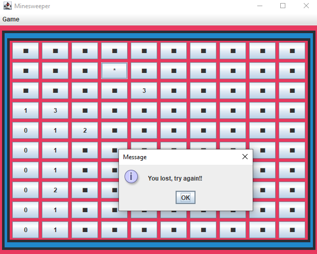

# Minesweeper

Minesweeper game made in java.



There are many things to do with the code, feel free to contribute!

\*Feel free to use it in your own project!\*

## Information

For more information view this wikipedia article:

[Wikipedia](https://en.wikipedia.org/wiki/Minesweeper_(video_game))

## To-do

```fix
On first click (if there's a mine) we should move that mine to a random corner.
Put icons on buttons.
Put a scoreboard.
Put the emoji for reactions.
Make a better-looking UI.
```

## Contributing
Pull requests are welcome. For major changes, please open an issue first to discuss what you would like to change.

## License
[GPL-3.0](https://choosealicense.com/licenses/gpl-3.0/)
